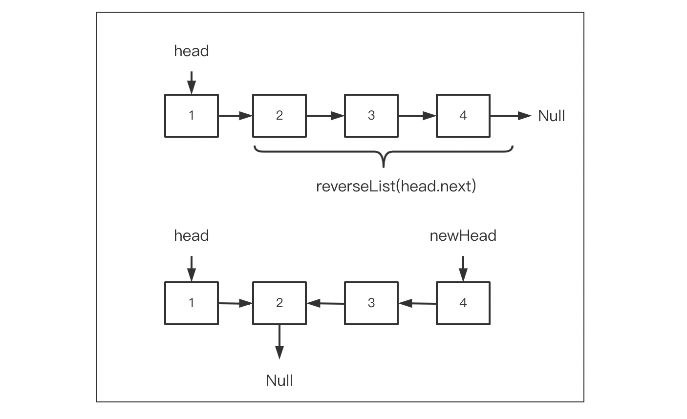

本文主要分析链表相关的算法问题。

#### [反转链表](https://leetcode-cn.com/problems/reverse-linked-list/)

给你单链表的头节点 `head` ，请你反转链表，并返回反转后的链表。

**示例 1：**


```
输入：head = [1,2,3,4,5]
输出：[5,4,3,2,1]
```

##### 解法一：双指针迭代

声明两个指针cur和prev，cur指向head，prev指向null。然后从前到后依次遍历cur，每次都将cur指向prev，然后prev和cur都往后移动，直到cur为空，此时prev指向最后一个节点，直接返回prev就是。

```java
private static class Solution {
    public ListNode reverseList(ListNode head) {
        if (head == null || head.next == null) {
            return head;
        }
        
        ListNode cur = head;
        ListNode prev = null;
        while (cur != null) {
            ListNode temp = cur.next;
            cur.next = prev;
            prev = cur;
            cur = temp;
        }

        return prev;
    }
}
```

##### 解法一：头插法

思路:

创建一个虚拟的头节点dummyHead，初始指向head。从head.next开始进行翻转操作，

ListNode cur = head.next;

然后依次进行遍历：

while(cur != null) {

    1. 先保存cur的下一个节点，供下一次遍历使用；(temp = cur.next)
    1. 把cur插入dummyHead.next的位置（cur.next = dummyHead.next; dummyHead.next =cur）
    1. 将temp赋值给cur，进行下一个节点的遍历(cur = temp)

}

注意：

要注意链表是否可能出现环！！

要注意链表是否可能出现环！！

要注意链表是否可能出现环！！


因为我们是从head.next开始遍历、不断地将遍历到的节点插入dummyhead头部，那最开始的head.next仍然指向原始的下一个节点。这样就产生了环。因此需要将head.next置为null，再开始遍历。

```java
private static class Solution {
    public ListNode reverseList(ListNode head) {
				if(head == null || head.next == null) {
            return head;
        }
 
        ListNode dummyHead = new ListNode(-1);
        dummyHead.next = head;
 
        ListNode cur = head.next;
        head.next = null;
        ListNode temp;
 
        while(cur != null) {
            temp = cur.next;
            cur.next = dummyHead.next;
            dummyHead.next = cur;
            cur = temp;
        }
 
        return dummyHead.next;
    }
```


```java
private static class Solution {
    public ListNode reverseList(ListNode head) {
        if (head == null || head.next == null) {
            return head;
        }

        ListNode dummyHead = new ListNode(-1);
        dummyHead.next = head;
        ListNode cur = head.next;
        while (cur != null) {
            head.next = cur.next;
            cur.next = dummyHead.next;
            dummyHead.next = cur;
            cur = head.next;
        }
        return dummyHead.next;
    }
}
```

##### 解法三：递归法

<div align="center">
  
  <p>
    <font size=2 color=gray style="border-bottom:1px solid #eee;">图：翻转列表-递归.png</font>
  </p>
</div>

```java
 /**
  * 递归解法
  */
private static class Solution3 {
    public ListNode reverseList(ListNode head) {
        if (head == null || head.next == null) {
            return head;
        }

        ListNode newHead = reverseList(head.next);
        head.next.next = head;
        head.next = null;
        return newHead;
    }
}
```

#### 删除链表的倒数第 N 个结点

19. 删除链表的倒数第 N 个结点

 给你一个链表，删除链表的倒数第 `n` 个结点，并且返回链表的头结点。 

  

示例 1：

```
输入：head = [1,2,3,4,5], n = 2
输出：[1,2,3,5]
```


示例 2：

```java
输入：head = [1], n = 1
输出：[]
```


示例 3：

```
输入：head = [1,2], n = 1
输出：[1]
```

**提示：**

- 链表中结点的数目为 `sz`
- `1 <= sz <= 30`
- `0 <= Node.val <= 100`
- `1 <= n <= sz`

解题思路：

题目要删除的是倒数第n个结点，那我们能不能先找正数第n个结点？然后将head结点（记为first）和正数第n个结点（记为second）同时往下走，当second结点到达最后一个结点时，first结点就是要删除的结点。

而要删除一个结点时，需要知道该结点的上一个结点。

具体实现：

```java
/**
 * Definition for singly-linked list.
 * public class ListNode {
 *     int val;
 *     ListNode next;
 *     ListNode() {}
 *     ListNode(int val) { this.val = val; }
 *     ListNode(int val, ListNode next) { this.val = val; this.next = next; }
 * }
 */
class Solution {
    public ListNode removeNthFromEnd(ListNode head, int n) {
        if(head == null) {
            return head;
        }

        if(head.next == null && n == 1) {
            return null;
        }

        ListNode dummyHead = new ListNode(-1);
        dummyHead.next = head;
        ListNode first = head;
        ListNode second = head;
        ListNode prev = dummyHead;

        //second指向第n个结点
        for(int i = 0; i < n - 1; i++) {
            second = second.next;
        }

        //想办法使second指向倒数第1个结点
        while(second.next != null) {
            prev = first;
            first = first.next;
            second = second.next;
        }

        //first结点就是我们要删除的结点
        prev.next = first.next;
        return dummyHead.next;
    }
}
```

#### 排序链表

[148. 排序链表](https://leetcode-cn.com/problems/sort-list/)

给你链表的头结点 `head` ，请将其按 **升序** 排列并返回 **排序后的链表** 。

解法一：

```java
public class Solution {
    /**
     * 代码中的类名、方法名、参数名已经指定，请勿修改，直接返回方法规定的值即可
     *
     * dummyHead 1 3 2 4 5
     *           
     * @param head ListNode类 the head node
     * @return ListNode类
     */
    public ListNode sortInList (ListNode head) {
        if(head == null || head.next == null) {
            return head;
        }

        ListNode dummyHead = new ListNode(-1);
        dummyHead.next = head;

        ListNode tail = head;
        ListNode cur = head.next;
        tail.next = null;
        ListNode next;
        
        while(cur != null) {
            //将cur插入到[dummyHead.next, tail]中合适的位置
            next = cur.next;

            ListNode pre = dummyHead;
            ListNode temp = pre.next;
            while(temp != null && temp.val < cur.val) {
                pre = temp;
                temp = temp.next;
            }

            pre.next = cur;
            cur.next = temp;

            if(temp == null) {
                tail = cur;
            }

            cur = next;
        }

        return dummyHead.next;
    }
}
```

解法二：

```java
public class Solution {
    /**
     * 代码中的类名、方法名、参数名已经指定，请勿修改，直接返回方法规定的值即可
     *
     * dummyHead 1 3 2 4 5
     *           
     * @param head ListNode类 the head node
     * @return ListNode类
     */
    public ListNode sortInList(ListNode head) {
        if(head == null || head.next == null) {
            return head;
        }

       
        List<ListNode> list  = new ArrayList<>();
        while(head !=null){
            list.add(head);
            head = head.next;
        }

        list.sort(new Comparator<ListNode>() {
            @Override
            public int compare(ListNode o1, ListNode o2) {
                return o1.val - o2.val;
            }
        });
        
        for(int i = 0 ; i < list.size() - 1;i++){
            list.get(i).next = list.get(i + 1);
        }
        list.get(list.size() - 1).next = null;
        return list.get(0);
    }
}
```

解法三：

```java
/**
 * 时间复杂度：o(nlogn)
 * 空间复杂度：o(logn)
 */
class Solution {
    public ListNode sortList(ListNode head) {
        if(head == null || head.next == null) {
            return head;
        }

        ListNode mid = findMiddle(head);
        ListNode midNext = mid.next;
        mid.next = null;

        ListNode left = sortList(head);
        ListNode right = sortList(midNext);
        return mergeSort(left, right);
    }

    //查找链表的中间结点
    private ListNode findMiddle(ListNode head) {
        ListNode fast = head;
        ListNode slow = head;
        while(fast != null && fast.next != null && fast.next.next != null) {
            fast = fast.next.next;
            slow = slow.next;
        }

        return slow;
    }

    private ListNode mergeSort(ListNode l1, ListNode l2) {
        ListNode dummyHead = new ListNode(-1);
        ListNode prev = dummyHead;

        while(l1 != null && l2 != null) {
            if(l1.val < l2.val) {
                prev.next = l1;
                prev = l1;
                l1 = l1.next;
            } else {
                prev.next = l2;
                prev = l2;
                l2 = l2.next;
            }
        }

        prev.next = l1 != null ? l1 : l2;

        return dummyHead.next;
    }
}
```

#### [分隔链表](https://leetcode-cn.com/problems/split-linked-list-in-parts/)

给你一个头结点为 head 的单链表和一个整数 k ，请你设计一个算法将链表分隔为 k 个连续的部分。

每部分的长度应该尽可能的相等：任意两部分的长度差距不能超过 1 。这可能会导致有些部分为 null 。

这 k 个部分应该按照在链表中出现的顺序排列，并且排在前面的部分的长度应该大于或等于排在后面的长度。

返回一个由上述 k 部分组成的数组。


示例 1：

```
输入：head = [1,2,3], k = 5
输出：[[1],[2],[3],[],[]]
解释：
第一个元素 output[0] 为 output[0].val = 1 ，output[0].next = null 。
最后一个元素 output[4] 为 null ，但它作为 ListNode 的字符串表示是 [] 。
```
示例 2：
```
输入：head = [1,2,3,4,5,6,7,8,9,10], k = 3
输出：[[1,2,3,4],[5,6,7],[8,9,10]]
解释：
输入被分成了几个连续的部分，并且每部分的长度相差不超过 1 。前面部分的长度大于等于后面部分的长度。
```
提示：

* 链表中节点的数目在范围 [0, 1000]
* 0 <= Node.val <= 1000
* 1 <= k <= 50

来源：力扣（LeetCode）
链接：https://leetcode-cn.com/problems/split-linked-list-in-parts
著作权归领扣网络所有。商业转载请联系官方授权，非商业转载请注明出处。

```java
class Solution {
    public ListNode[] splitListToParts(ListNode head, int k) {
        ListNode[] result = new ListNode[k];
        int len = 0;
        ListNode cur = head;
        ListNode prev = null;

        //计算链表的总长度
        while(cur != null) {
            len++;
            cur = cur.next;
        }
      
        int left = len % k;
        cur = head;
        prev = cur;

        int itemSize = 0;
        for(int i = 0; i < k; i++) {
            if(left-- > 0) {
                itemSize = len / k + 1;
            } else {
                itemSize = len / k;
            }

            if(itemSize == 0) {
                result[i] = null;
                continue;
            }
            
            result[i] = cur;
            while(itemSize > 0) {
               prev = cur;
               cur = cur.next;
               itemSize--;
           }

           prev.next = null;
       }

       return result;
    }
}
```

#### [重排链表](https://leetcode-cn.com/problems/reorder-list/)

给定一个单链表 L 的头节点 head ，单链表 L 表示为：

`L0 → L1 → … → Ln - 1 → Ln`

请将其重新排列后变为：

`L0 → Ln → L1 → Ln - 1 → L2 → Ln - 2 → …`

不能只是单纯的改变节点内部的值，而是需要实际的进行节点交换。

解法一：

先将每一个节点用List缓存起来，然后适用双指针前后遍历，将节点串起来。

需要注意的点是，最后一个节点的next一定要置为空，不然会出现环。

```java
class Solution {
    public void reorderList(ListNode head) {
        List<ListNode> list = new ArrayList<>();
        while(head != null) {
            list.add(head);
            head = head.next;
        }

        int i = 0, j = list.size() - 1;
        while(i < j) {
            list.get(i).next = list.get(j);
            i++;
            if(i == j) {
                break;
            }

            list.get(j).next = list.get(i);
            j--;
        }
        
        //最后i和j会相等，这里如果不将list.get(i).next置为空就会出现环。
        list.get(i).next = null;
    }
}
```

解法二：

```java
class Solution {
    public void reorderList(ListNode head) {
        if (head == null || head.next == null) {
            return;
        }

        ListNode fast = head;
        ListNode slow = head;
        ListNode prev = slow;
        while (fast != null && fast.next != null) {
            fast = fast.next.next;
            prev = slow;
            slow = slow.next;
        }

        prev.next = null;
        ListNode dummyHead = new ListNode(0);
        dummyHead.next = slow;

        ListNode cur = slow.next;
        slow.next = null;
        ListNode nex;
        while (cur != null) {
            nex = cur.next;
            cur.next = dummyHead.next;
            dummyHead.next = cur;
            cur = nex;
        }

        ListNode n1 = head;
        ListNode n2 = dummyHead.next;

        ListNode nex1 = n1, nex2 = n2;
        while (n1.next != null && n2.next != null) {
            nex1 = n1.next;
            nex2 = n2.next;
            n1.next = n2;
            n2.next = nex1;
            n1 = nex1;
            n2 = nex2;
        }

        if(n1.next == null) {
            n1.next = n2;
        }
    }
}
```

#### **链表内指定区间反转**

描述

将一个节点数为 size 链表 m 位置到 n 位置之间的区间反转，要求时间复杂度 *O*(*n*)，空间复杂度 *O*(1)。
例如：
给出的链表为 1→2→3→4→5→NULL, m=2, n=4,
返回 1→4→3→2→5→NULL

数据范围： 链表长度 0≤10000<size≤1000，0<*m*≤*n*≤size，链表中每个节点的值满足|val| ≤ 1000

要求：时间复杂度 *O*(*n*) ，空间复杂度 *O*(*n*)

进阶：时间复杂度 *O*(*n*)，空间复杂度 *O*(1)

示例1

输入：

```
{1,2,3,4,5},2,4
```

返回值：

```
{1,4,3,2,5}
```

示例2

输入：

```
{5},1,1
```

返回值：

```
{5}
```

解题思路：

需要记录4个节点：

1. m的前一个节点，记为pre;
2. 第m个节点，记为left；
3. 第n个节点，记为right；
4. n的下一个节点，记为next；

将链表[m, n]进行翻转，然后将翻转后的局部链表拼接上去。将pre.next指向right，left.next指向next。

注意：

​    将right的下一个位置记录好以后，需要将right.next置为null，这样翻转局部链表时，遍历到null即表示局部链表结束。

```java
public class Solution {
    /**
     * 代码中的类名、方法名、参数名已经指定，请勿修改，直接返回方法规定的值即可
     *
     * 
     * @param head ListNode类 
     * @param m int整型 
     * @param n int整型 
     * @return ListNode类

     * {1,2,3,4,5}, m = 2, n = 4
     */
    public ListNode reverseBetween(ListNode head, int m, int n) {
        if(m == n) {
            return head;
        }

        ListNode dummyHead = new ListNode(-1);
        dummyHead.next = head;

        ListNode pre = dummyHead, next, left, right;

        for(int i =0; i < m - 1; i++) {
            pre = pre.next;
        }

        left = pre.next;
        right = left;
        for(int i = 0; i < n - m; i++) {
            right= right.next;
        }

        next = right.next;
        right.next = null;
        reverse(left);
        pre.next = right;
        left.next = next;
        return dummyHead.next;
    }

    private ListNode reverse(ListNode head) {
        if(head == null || head.next == null) {
            return head;
        }

        ListNode dummyHead = new ListNode(-1);
        dummyHead.next = head;

        ListNode cur = head.next;
        head.next = null;

        ListNode temp;
        while(cur != null) {
            temp = cur.next;
            cur.next = dummyHead.next;
            dummyHead.next = cur;
            cur = temp;
        }

        return dummyHead.next;
    }
}
```

#### [ 合并两个有序链表](https://leetcode.cn/problems/merge-two-sorted-lists/)

将两个升序链表合并为一个新的 **升序** 链表并返回。新链表是通过拼接给定的两个链表的所有节点组成的。 

 

**示例 1：**


```
输入：l1 = [1,2,4], l2 = [1,3,4]
输出：[1,1,2,3,4,4]
```

**示例 2：**

```
输入：l1 = [], l2 = []
输出：[]
```

**示例 3：**

```
输入：l1 = [], l2 = [0]
输出：[0]
```

 

**提示：**

- 两个链表的节点数目范围是 `[0, 50]`
- `-100 <= Node.val <= 100`
- `l1` 和 `l2` 均按 **非递减顺序** 排列

#### 判断一个链表是否为回文结构

描述

给定一个链表，请判断该链表是否为回文结构。

回文是指该字符串正序逆序完全一致。

数据范围： 链表节点数 0≤*n*≤10^5^，链表中每个节点的值满足|val|<= 10^7^

思路：

​    顺序遍历链表，将链表中的节点的值放入ArrayList中，然后判断ArrayList是否为回文。

​    注意：

​    两个Integer对象比较大小应该用compareTo(Integer anotherInteger)方法。

    ```java
    Integer a = -221;
    Integer b = -222;
    //compareTo(Integer)的返回值：
    //a < b: -1
    //a == b: 0
    //a > b: 1
    System.out.println(a.compareTo(b));
    ```

#### **删除有序链表中重复的元素-II**

给出一个升序排序的链表，删除链表中的所有重复出现的元素，只保留原链表中只出现一次的元素。
例如：
给出的链表为1→2→3→3→4→4→51→2→3→3→4→4→5, 返回1→2→51→2→5.
给出的链表为1→1→1→2→31→1→1→2→3, 返回2→32→3.

数据范围：链表长度 0≤*n*≤10000，链表中的值满足|va|≤1000

要求：空间复杂度O*(*n*)，时间复杂度 *O*(*n*)

进阶：空间复杂度 O*(1)，时间复杂度*O*(*n*)

示例1

输入：

```
{1,2,2}
```

返回值：

```
{1}
```

示例2

输入：

```
{}
```

返回值：

```
{}
```

思路:

代码：

```java
public class Solution {
    /**
     * 代码中的类名、方法名、参数名已经指定，请勿修改，直接返回方法规定的值即可
     *
     * 1 -> 2 -> 3 -> 3 -> 4 -> 4 -> 5.
     * @param head ListNode类 
     * @return ListNode类
     */
    public ListNode deleteDuplicates (ListNode head) {
        if(head == null || head.next == null) {
            return head;
        }

        ListNode dummyHead = new ListNode(Integer.MIN_VALUE);
        dummyHead.next = head;
        
        ListNode cur = head;
        //维护cur的前一个节点，因为在遍历cur时存在删除cur的场景。
        ListNode pre = dummyHead;

        //遍历cur时，向后再多看一步
        while(cur != null && cur.next != null) {
            if(cur.val == cur.next.val) {
                //cur后面有与cur相等的节点, 穷举完所有与cur相同的节点，连同cur一起删除。
                int target = cur.val;
                ListNode temp = cur.next;
                while(temp != null && temp.val == target) {
                    temp = temp.next;
                }

                //temp最终指向null或与target不相等的节点
                pre.next = temp;
                cur = temp;
            } else {
                //cur的下一个节点与cur不相等
                pre = cur;
                cur = cur.next;
            }
        }
        return dummyHead.next;
    }
}
```

