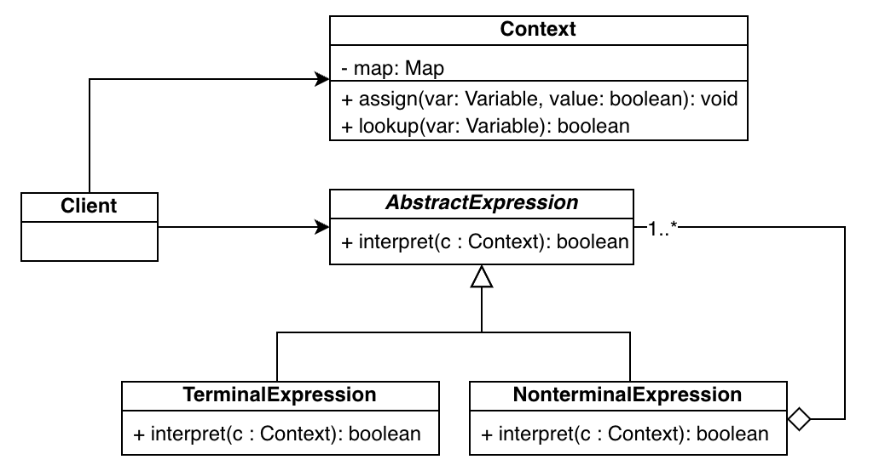

常用设计模式的总结。

###   一、创建型模式（Creational Patterns）

#### 1. 工厂方法（Factory Method）

###### 1.1 意图（Intent）：

Define an interface for creating an object, but let subclasses decide which class to instantiate. Factory Method lets a class defer instantiation to subclasses.
定义一个用于创建对象的接口，但是让子类决定实例化哪一个类。工厂方法使一个类的实例化延迟到其子类。

- 工厂方法中的角色：
    Product：抽象产品
    ConcreteProduct：具体产品
    Factory：抽象工厂
    ConcreteFactory：具体工厂

###### 1.2 适用场景：

（1）如果无法预知对象的确切类别及其依赖关系时，可以考虑使用工厂方法；
工厂方法将创建产品的代码与实际使用产品的代码分离，从而能在不影响其他代码的情况下，扩展创建产品部分的代码；
（2）如果你希望用户能扩展你的软件库或框架的内部组件，可使用工厂方法；
（3）如果你希望使用现有对象来节省系统资源，而不是每次都重新创建对象，可使用工厂方法；
工厂方法可以返回缓存、对象池或其他来源的已有对象。

- 优点

1. 避免创建者和具体产品之间的紧密耦合；
2. 单一职责原则：将产品创建代码放在程序的单一位置，从而使代码更容易维护；
3. 开闭原则：无须改变现有的客户端代码，就可以在程序中引入新的产品类型；

 - 缺点

1. 需要引入许多新的子类， 代码可能会因此变得更复杂。 最好的情况是将该模式引入创建者类的现有层次结构中。

#### 2. 抽象工厂（Abstract Factory）

- 意图（Intent）：
    Provide an interface for creating families of related or dependent objects without specifying their concrete classes.
    提供一个创建一系列相关或相互依赖的对象的接口，而无需指定它们具体的类。

- 抽象工厂中的角色
    抽象工厂（Abstract Factory）
    具体工厂（Concrete Factory）
    抽象产品（Abstract Product）
    ——声明同一种类型的产品接口；
    具体产品（Concrete Product）
    —— 定义一个被相应的具体工厂创建的产品对象。

- 适用场景：
    简单工厂模式针对的是一个产品等级结构（即继承自同一种抽象产品的体系），而抽象工厂针对的是多个产品等级结构。
    对于新增加的产品族，只需要对应增加一个新的具体工厂即可，对已有代码无须做任何修改。

- 优缺点：
    ① 分离了具体的类；
    ② 可以很方便的动态更换产品族
    只要更换具体工厂，就可以做到更换产品族（product families），因为一个具体工厂会创建一整个产品族（a complete family of products）。
    系统中有多于一个的产品族，而每次只使用其中某一个产品族。
    ③ 有利于保持产品的一致性
    属于同一个产品族的产品将在一起使用，这一约束必须在系统的设计中体现出来。
    ④ 添加新的产品类型比较困难，因为AbstractFactory接口确定了所有可以被创建的产品集合，支持新种类的产品就需要扩展该工厂接口，这将涉及AbstractFactory及其所有子类的更改。
    当Abstract Factory模式中每一种具体工厂类只创建一个产品对象时，也就是只存在一个产品体系结构时，退化为Factory Method模式；
    当Factory Method模式中抽象工厂与具体工厂合并，提供一个统一的工厂来创建对象，并将创建对象的工厂设计为静态方法时，就退化为Simple Factory模式；

#### 3. 生成器（Builder）

- 意图（Intent）：
        Separate the construction of a complex object from its representation so that the same construction process can create different representations.
        将一个复杂对象的构建（construction ）与它每一过程中的实现细节分离，使得同样的构建过程可以创建（create）出不同类型（types ）和形式（representations）的产品对象。

#### 4. 原型（Prototype）

意图（Intent）：
Specify the kinds of objects to create using a prototypical instance, and create new objects by copying this prototype.
用原型实例指定创建对象的种类，并且通过拷贝这些原型创建新的对象。

#### 5. 单例（Singleton）

- 意图（Intent）：
    Ensure a class only has one instance, and provide a global point of access to it.
    保证一个类仅有一个实例，并提供一个访问它的全局访问点。

###  二、结构型模式（Structural Patterns）

结构型模式（Structural Patterns）关注如何将类和对象组织在一起形成更加强大的结构。

**Structural class patterns**: use inheritance to compose interfaces or implementations. 

**structural object patterns**: describe ways to compose objects to realize new functionality.

Composite: describes how to build a class hierarchy made up of classes for two kinds of objects: primitive and composite;

Proxy:  a proxy acts as a convenient surrogate or placeholder for another object

Flyweight: defines a structure for sharing objects.

Facade: shows how to make a single object represent an entire subsystem;

Bridge: separates an object's abstraction from its implementation so that you can vary them independently;

Decorator: describes how to add responsibilities to objectsdynamically;

####  6. 适配器（Adapter）

将一个类的接口转化成客户端希望的另一个接口，从而使接口不兼容的类能够相互合作。
Convert the interface of a class into another interface clients expect. Adapter lets classes work together that couldn't otherwise because of incompatible interfaces.

  
  
图：Addapter模式.png

**适用场景：**

- 当你希望使用某个类， 但是其接口与其他代码不兼容时， 可以使用适配器类。
  适配器模式允许你创建一个中间层类， 其可作为代码与遗留类、 第三方类或提供怪异接口的类之间的转换器。
  
- 如果您需要复用这样一些类， 他们处于同一个继承体系， 并且他们又有了额外的一些共同的方法， 但是这些共同的方法不是所有在这一继承体系中的子类所具有的共性。

**适配器模式概述**

​    在适配器模式中引入了一个被称为适配器（Adapter）的包装类，而它所包装的对象称为适配者（Adaptee），即被适配的类。

**优缺点：**

\+ 单一职责原则：你可以将接口或数据转换代码从程序主要业务逻辑中分离。
\- 开闭原则：只要客户端代码通过客户端接口与适配器进行交互， 你就能在不修改现有客户端代码的情况下在程序中添加新类型的适配器。
\- 代码整体复杂度增加： 因为你需要新增一系列接口和类。 有时直接更改服务类使其与其他代码兼容会更简单。

**与其它模式的关系：**

- **桥接模式**通常会于开发前期进行设计， 使你能够将程序的各个部分独立开来以便开发。 而**适配器模式**通常在已有程序中使用， 让相互不兼容的类能很好地合作。
- **适配器**可以对已有对象的接口进行修改， **装饰模式**则能在不改变对象接口的前提下强化对象功能。 此外， 装饰还支持递归组合， 适配器则无法实现。
- **适配器**能为被封装对象提供不同的接口， **代理模式**能为对象提供相同的接口， **装饰**则能为对象提供加强的接口。
- **外观模式**为现有对象定义了一个新接口， **适配器**则会试图运用已有的接口。 适配器通常只封装一个对象， 外观通常会作用于整个对象子系统上。
- **桥接**、 **状态模式**和**策略模式** （在某种程度上包括**适配器**） 模式的接口非常相似。 实际上， 它们都基于**组合模式**——即将工作委派给其他对象， 不过也各自解决了不同的问题。 模式并不只是以特定方式组织代码的配方， 你还可以使用它们来和其他开发者讨论模式所解决的问题。

####  7. 桥接（Bridge）

将抽象部分与它的实现部分分离，使两者可以独立的变化。

Decouple an abstraction from its implementation so that the two can vary independently.

​    当在两个独立维度的层次结构中使用继承扩展类时，将导致代码复杂程度指数增长。桥接模式通过将继承改为组合的方式来解决这个问题。 具体来说， 就是抽取其中一个维度、只持有它的抽象引用，具体的实现部分可以动态替换。

  
  
图：Bridge模式.png

##### 适用场景：

- 如果你想要拆分或重组一个具有多重功能的庞杂类 （例如能与多个数据库服务器进行交互的类）， 可以使用桥接模式。

​    类的代码行数越多， 弄清其运作方式就越困难， 对其进行修改所花费的时间就越长。 一个功能上的变化可能需要在整个类范围内进行

修改， 而且常常会产生错误， 甚至还会有一些严重的副作用。

​    桥接模式可以将庞杂类拆分为几个类层次结构（class hierarchies）。 此后， 你可以独立地修改任意一个类层次结构而不会影响到其他

类层次结构。 这种方法可以简化代码的维护工作， 并将修改已有代码的风险降到最低。

- 一个类存在两个独立变化的维度，且这两个维度都有扩展的需要。

​    桥接建议将每个维度抽取为独立的类层次。 初始类将相关工作委派给属于对应类层次的对象， 无需自己完成所有工作。

- 如果你需要在运行时切换不同实现方法， 可使用桥接模式。

桥接模式可动态替换抽象对象的实现类， 从这个角度来说，和策略模式的效果一样。

##### 优缺点：

\+ Decoupling interface and implementation. 

实现部分并不会永久的和一个接口绑定，一个abstraction的实现部分（implementation）可以在运行期配置，甚至可以在运行期动态改变；

\+ Improved extensibility. 

你可以相互独立的扩展Abstraction和Implementor的层次结构；

\+ Hiding implementation details from clients. 

你可以对Clientsn隐藏实现的细节，例如implementor对象的共享信息和相应的引用计数机制。

\-  You might make the code more complicated by applying the pattern to a highly cohesive class.

对高内聚的类使用该模式可能会让代码更加复杂。

##### 与其它模式的关系：

 - **桥接模式**通常会于开发前期进行设计， 使你能够将程序的各个部分独立开来以便开发。 然而**适配器模式**通常在已有程序中使用， 让相互不兼容的类能很好地合作。

 - **桥接、 状态模式和策略模式** （在某种程度上包括**适配器**） 模式的接口非常相似。 实际上， 它们都基于组合模式——即将工作委派给其他对象， 不过也各自解决了不同的问题。 模式并不只是以特定方式组织代码的配方， 你还可以使用它们来和其他开发者讨论模式所解决的问题。

- 你可以将**抽象工厂模式**和**桥接**搭配使用。 如果由桥接定义的抽象只能与特定实现合作， 这一模式搭配就非常有用。 在这种情况下， 抽象工厂可以对这些关系进行封装， 并且对客户端代码隐藏其复杂性。

- 你可以结合使用**生成器模式**和**桥接模式**： 主管类负责抽象工作， 各种不同的生成器负责实现工作。

#### 8. 组合（Composite）

将对象组合成树状结构，以表示“部分-整体”的层次结构。组合模式使得用户可以相同的方式对待单个对象和组合对象。

Compose objects into tree structures to represent part-whole hierarchies. Composite lets clients treat individual objects and compositions of objects uniformly.

  
  
图：Composite模式.png

##### 适用场景

- 如果你需要实现树状对象结构，可以使用组合模式。

组合模式为你提供了两种共享公共接口的基本元素类型： 简单叶节点和复杂容器。 容器中可以包含叶节点和其他容器。 这使得你可以构建树状嵌套递归对象结构。

- 如果你希望客户端代码以相同方式处理简单和复杂元素， 可以使用该模式。

组合模式中定义的所有元素共用同一个接口。 在这一接口的帮助下， 客户端不必在意其所使用的对象的具体类。

##### 与其它模式的关系

- 桥接模式、 状态模式和策略模式 （在某种程度上包括适配器模式） 模式的接口非常相似。 实际上， 它们都基于组合模式——即将工作委派给其他对象， 不过也各自解决了不同的问题。 模式并不只是以特定方式组织代码的配方， 你还可以使用它们来和其他开发者讨论模式所解决的问题。

- 你可以在创建复杂组合树时使用生成器模式， 因为这可使其构造步骤以递归的方式运行。

- 责任链模式通常和组合模式结合使用。 在这种情况下， 叶组件接收到请求后， 可以将请求沿包含全体父组件的链一直传递至对象树的底部。

- 你可以使用迭代器模式来遍历组合树。

- 你可以使用访问者模式对整个组合树执行操作。

- 你可以使用享元模式实现组合树的共享叶节点以节省内存。

- 组合和装饰模式的结构图很相似， 因为两者都依赖递归组合来组织无限数量的对象。

​     装饰类似于组合， 但其只有一个子组件。 此外还有一个明显不同： 装饰为被封装对象添加了额外的职责， 组合仅对其子节点的结果进行了 “求和”。但是， 模式也可以相互合作： 你可以使用装饰来扩展组合树中特定对象的行为。

- 大量使用组合和装饰的设计通常可从对于原型模式的使用中获益。 你可以通过该模式来复制复杂结构， 而非从零开始重新构造。

#### 9. 装饰（Decorator）

通过将对象（Wrappee Object）放入特殊封装对象（Wrapper Objects）为原对象增加新的行为。

Attach additional responsibilities to an object dynamically. Decorators provide a flexible alternative to subclassing for extending functionality.

  
  
图：Decorator模式.png

##### 适用场景

- 如果你希望在无需修改代码的情况下即可使用对象， 且希望在运行时为对象新增额外的行为， 可以使用装饰模式。

装饰能将业务逻辑组织为层次结构， 你可为各层创建一个装饰， 在运行时将各种不同逻辑组合成对象。 由于这些对象都遵循通用接口， 客户端代码能以相同的方式使用这些对象。

- 如果用继承来扩展对象行为的方案难以实现或者根本不可行， 你可以使用该模式。

许多编程语言使用 final最终关键字来限制对某个类的进一步扩展。 复用最终类已有行为的唯一方法是使用装饰模式： 用封装器对其进行封装。

##### 优缺点

- 你无需创建新子类即可扩展对象的行为。
- 你无需创建新子类即可扩展对象的行为。
- 你可以在运行时添加或删除对象的功能。
- 你可以用多个装饰封装对象来组合几种行为。
- 单一职责原则。 你可以将实现了许多不同行为的一个大类拆分为多个较小的类。
- 在封装器栈中删除特定封装器比较困难。
- 实现行为不受装饰栈顺序影响的装饰比较困难。
- 各层的初始化配置代码看上去可能会很糟糕。

##### 与其它模式的关系

- **适配器**模式可以对已有对象的接口进行修改， **装饰**模式则能在不改变对象接口的前提下强化对象功能。 此外， 装饰还支持递归组合， 适配器则无法实现。

- **适配器**能为被封装对象提供不同的接口， **代理模式**能为对象提供相同的接口， **装饰**则能为对象提供加强的接口。

- **责任链模式**和**装饰模式**的类结构非常相似。 两者都依赖递归组合将需要执行的操作传递给一系列对象。 但是， 两者有几点重要的不同之处。
    - 责任链的管理者可以相互独立地执行一切操作， 还可以随时停止传递请求。 然而装饰着模式的各种装饰可以在遵循基本接口的情况下扩展对象的行为。 此外， 装饰无法中断请求的传递。

- **组合模式**和**装饰**的结构图很相似， 因为两者都依赖递归组合来组织无限数量的对象。
    - 装饰类似于组合， 但其只有一个子组件。 此外还有一个明显不同： 装饰为被封装对象添加了额外的职责， 组合仅对其子节点的结果进行了 “求和”。
    - 但是， 模式也可以相互合作： 你可以使用装饰来扩展组合树中特定对象的行为。

- 大量使用**组合**和**装饰**的设计通常可从对于原型模式的使用中获益。 你可以通过该模式来复制复杂结构， 而非从零开始重新构造。

- **装饰**可让你更改对象的外表， **策略**模式则让你能够改变其本质。

- **装饰**和**代理**有着相似的结构， 但是其意图却非常不同。 这两个模式的构建都基于组合原则， 也就是说一个对象应该将部分工作委派给另一个对象。 两者之间的不同之处在于代理通常自行管理其服务对象的生命周期， 而装饰的生成则总是由客户端进行控制。

#### 10. 外观（Facade）

Provide a unified interface to a set of interfaces in a subsystem. Facade defines a higher-level interface that makes the subsystem easier to use.
为包含许多活动部件的复杂子系统提供一个简单的接口。Facade定义了一个更高层次的接口、使得子系统更加易用。

  
  
图：Facade模式.png

##### 适用场景

- 如果你需要一个指向复杂子系统的直接接口， 且该接口的功能有限， 则可以使用外观模式。

- 如果需要将子系统组织为多层结构， 可以使用外观。

    创建外观来定义子系统中各层次的入口。 你可以要求子系统仅使用外观来进行交互， 以减少子系统之间的耦合。

##### 优缺点

- 你可以让自己的代码独立于复杂子系统。
- 外观可能成为与程序中所有类都耦合的上帝对象。

##### 与其他模式的关系

- 外观模式为现有对象定义了一个新接口， 适配器模式则会试图运用已有的接口。 适配器通常只封装一个对象， 外观通常会作用于整个对象子系统（subsystem of objects）上。
- 当只需对客户端代码隐藏子系统创建对象的方式时， 你可以使用抽象工厂模式来代替外观。
- 享元模式展示了如何生成大量的小型对象， 外观则展示了如何用一个对象来代表整个子系统。
- 外观和中介者模式的职责类似： 它们都尝试在大量紧密耦合的类中组织起合作。
    - 外观为子系统中的所有对象定义了一个简单接口， 但是它不提供任何新功能。 子系统本身不会意识到外观的存在。 子系统中的对象可以直接进行交流。
    - 中介者将系统中组件的沟通行为中心化。 各组件只知道中介者对象， 无法直接相互交流。
        外观类通常可以转换为单例模式类， 因为在大部分情况下一个外观对象就足够了。

- 外观与代理模式的相似之处在于它们都缓存了一个复杂实体并自行对其进行初始化。 代理与其服务对象遵循同一接口， 使得自己和服务对象可以互换， 在这一点上它与外观不同。

#### 11. 享元（Flyweight）

Use sharing to support large numbers of fine-grained objects efficiently.
享元是一种结构型设计模式， 它允许你在消耗少量内存的情况下支持大量对象。模式通过共享多个对象的部分状态来实现上述功能。 换句话来说， 享元会将不同对象的相同数据进行缓存以节省内存。

对象的常量数据通常被称为*内在状态（intrinsic state*）， 其位于对象内部， 只能被其它对象读取、而不能被修改。 而对象的其余状态—也即经常会被外部修改的状态，被称为*外在状态（*extrinsic state*.）*。

享元模式建议不在对象中存储外在状态， 而是将其传递给另外一个依赖于它的方法。

程序只在对象中保存内在状态， 以方便在不同情景下重用。 这些对象的区别仅在于其内在状态，因此你所需的对象数量会大大削减。 

由于享元对象可在不同的情景中使用， 你必须确保其状态不能被修改。 享元类的状态只能由构造函数的参数进行一次性初始化， 它不能对其他对象公开其设置器（setters）或公有成员变量（public fields ）。

##### 适用场景

- 当我们需要创建大量的相似对象，它们之间只有一少部分参数不同、其余大部分的参数都相同时，可以考虑适用享元模式；
- 我们需要控制创建大量对象时的内存消耗时，即希望通过创建较少的、可共享的对象来减少内存消耗。

##### 优缺点：

- 如果程序中有很多相似对象， 那么你将可以节省大量内存。
- 你可能需要牺牲执行速度来换取内存，因为他人每次调用享元方法时都需要重新计算部分情景数据。
- 代码会变得更加复杂。 团队中的新成员总是会问：  “为什么要像这样拆分一个实体的状态？”。

##### 与其它模式的关系：

- 你可以使用享元模式实现组合模式树的共享叶节点以节省内存。
- 享元展示了如何生成大量的小型对象， 外观模式则展示了如何用一个对象来代表整个子系统。
- 如果你能将对象的所有共享状态简化为一个享元对象， 那么享元就和单例模式类似了。 但这两个模式有两个根本性的不同。
    - 单例只会有一个单例实体， 但是享元类可以有多个实体， 各实体的内在状态也可以不同。
    - 单例对象可以是可变的。 享元对象是不可变的。

#### 12. 代理（Proxy）

Provide a surrogate or placeholder for another object to control access to it.
为源对象提供一个替代品或占位符，以实现对源对象的控制。
代理模式适合应用场景：

1. 延迟初始化（虚拟代理）
    如果你有一个偶尔使用的重量级服务对象，一直保持该对象运行会消耗系统资源时，可使用代理模式。
2. 访问控制（保护代理）
    如果你只希望特定客户端使用服务对象，这里的对象可以是操作系统中非常重要对的部分，而客户端则是各种已启动的程序（包括恶意程序），此时可使用代理模式。代理可仅在客户端凭据满足要求时将请求传递给服务对象。
3. 本地执行远程服务（远程代理）
    适用于服务对象位于远程服务器上的情形，代理通过网络传递客户端请求，负责处理所有与网络相关的复杂细节。
4. 记录日志请求（日志记录代理）
    适用于当你需要保存对于服务对象的请求历史记录时。 代理可以在向服务传递请求前进行记录。
5. 缓存结果代理（缓存代理）
    适用于需要缓存客户请求结果并对缓存生命周期进行管理时， 特别是当返回结果的体积非常大时。代理可对重复请求所需的相同结果进行缓存， 还可使用请求参数作为索引缓存的键值。
6. 智能引用
    代理会将所有获取了指向服务对象或其结果的客户端记录在案。 代理会时不时地遍历各个客户端， 检查它们是否仍在运行。 如果相应的客户端列表为空， 代理就会销毁该服务对象， 释放底层系统资源。

* 与其它模式的关系
    Adaper能为封装对象（wrapped object）提供不同的接口；Proxy能为封装对象提供相同的接口；Decorator则能为之提供加强的接口。
    Facade与Proxy的相似之处在于它们都缓存了一个复杂实体（ complex entity）并且按照自己的方式进行实例化；不同之处是代理与其服务对象遵循同一接口， 使得自己和服务对象可以互换。
    Decorator与Proxy的不同之处在于代理通常自行管理其服务对象的生命周期，然后Decorator中装饰器的组合通常用客户端来控制。

### 三、行为模式（Behavioral Patterns）

Behavior模式侧重对象之间的交互和职责划分（Behavioral design patterns are concerned with algorithms and the assignment of responsibilities between objects）；

1. **Behavior class patterns:** 使用继承分发行为

    Template Method: 父类定义算法的框架，子类通过继承父类的抽象方法提供具体实现；

    Interpreter: 将语法表示为一种类层次结构（class hierarchy）；

2. **Behavioral object patterns**：使用对象组合分发行为

    Mediator：

    Chain of Responsibility

    Observer：

3. **Other patterns**:  关注将行为封装成一个对象、然后将请求委托给它(encapsulating behavior in an object
    and delegating requests to it)。

​		Strategy: 将一个算法封装进对象；

​        Command：将一个请求封装进对象；

​        State: 封装一个对象的所有状态，使得当对象的状态发生改变时，对象可以改变他的行为。

​        Visitor: encapsulates behavior that would otherwise be distributed across classes;

​		Iterator:  abstractsthe way you accessand traverse objects in an aggregate;

#### 13. 责任链（Chain Of Responsibility）

**Chain of Responsibility** is a behavioral design pattern that lets you pass requests along a chain of handlers. Upon receiving a request, each handler decides either to process the request or to pass it to the next handler in the chain.

职责链允许你将请求沿着处理者链进行发送。 收到请求后， 每个处理者均可对请求进行处理， 或将其传递给链上的下个处理者。
责任链会将特定行为（particular behaviors）转化为称为处理者（handles）的独立对象。模式建议你将这些处理者连成一条链。 链上的每个处理者都持有下一处理者的引用（reference）。 

除了处理请求外， 处理者还负责沿着链传递请求。 请求会在链上移动， 直至所有处理者都有机会对其进行处理。处理者也可以决定不再沿着链传递请求， 这可高效地取消所有后续处理步骤。

##### 应用场景：

- 当程序需要使用多种方式处理不同种类请求**，** 而且请求类型和顺序预先未知时，可以使用责任链模式。
- 当必须按特定顺序（particular order）执行多个处理者时， 可以使用该模式。因为你可以以任意顺序链接处理者，所有的请求都会按你设计的顺序精确执行。
- 当处理者的集合（the set of handlers）及其顺序需要在运行时进行改变， 可以使用责任链模式。你可以提供setters方法进行动态地添加、删除或者重排序。

##### 优缺点：

- 你可以控制请求处理的顺序。
-  单一职责原则。 你可对发起操作和执行操作的类进行解耦。
-  开闭原则。 你可以在不更改现有代码的情况下在程序中新增处理者。
-  部分请求可能未被处理。

##### 与其他模式的关系：

- **责任链（Chain of Responsibility**）、**命令行（Command）**、**中介者（Mediator）**和**观察者（Observer）**都用于处理请求的发送者和接收者之间的不同连接方式：

    - 责任链按照顺序将请求动态传递给一系列的潜在接收者， 直到其中一名接收者对请求进行处理。

    - 命令行模式在发送者和接收者之间建立了单向连接；

    - 中介者清除了发送者和请求者之间的直接连接， 强制它们通过一个中介对象进行间接沟通。
    - 观察者允许接收者动态地订阅或取消接收请求。

- **责任链**通常和**组合模式**结合使用。在这种情况下， 当一个叶组件（leaf component）接收到请求后， 可以将请求沿包含全体父组件（all of the parent components）的链一直传递至对象树的底部。

- **责任链**的管理者可使用**命令模式**实现。 在这种情况下， 你可以对由请求代表的同一个上下文对象执行许多不同的操作。

    还有另外一种实现方式， 那就是请求自身就是一个*命令*对象。 在这种情况下， 你可以对由一系列不同上下文连接而成的链执行相同的操作。

- **责任链**和**装饰模式**有非常相似的类结构（class structures），两者都依赖递归组合（recursive composition）将执行操作（execution）传递给一系列对象，但是也有几点重要的不同：

  - 责任链的管理者可以相互独立地执行一切操作， 也可以随时停止传递请求。 而装饰模式的装饰者（Decorators）可以在遵循基本接口的情况下扩展对象的行为，但无法中断请求的传递。

#### 14. 命令（Command）

Encapsulate a request as an object, thereby letting you parameterize clients with different requests, queue or log requests, and support undoable operations.
将一个请求封装为一个对象，从而使可以将请求作为函数的参数传递、延迟请求执行或者将其放入队列中、记录请求日志，以及支持撤销操作。

  
  
图：Command模式.png

##### 适用场景：

- 如果你需要将操作（operations）转化为参数化对象时，可使用命令模式。
    - Command模式可以将一个特定的方法调用（method call）转换成一个独立对象。你可以将commands作为函数的方法进行传递、将其存储在其它对象中、在运行时切换已链接的命令等等。
- 如果你想要将操作放入队列中、 调度操作的执行或者远程执行操作， 可使用命令模式。
- 如果你想要实现操作回滚功能， 可使用命令模式。

##### 优缺点：

- 单一职责原则。 你可以解耦触发和执行操作的类。
-  开闭原则。 你可以在不修改已有客户端代码的情况下在程序中创建新的命令。
-  你可以实现撤销和恢复功能。
-  你可以实现操作的延迟执行。
-  你可以将一组简单命令组合成一个复杂命令。
- 代码可能会变得更加复杂， 因为你在发送者和接收者之间引入了一个新的层级（layer）。

#####  与其它模式的关系

- **责任链（Chain of Responsibility**）、**命令行（Command）**、**中介者（Mediator）**和**观察者（Observer）**都用于处理请求的发送者和接收者之间的不同连接方式：
    - 责任链按照顺序将请求动态传递给一系列的潜在接收者， 直到其中一名接收者对请求进行处理。
    - 命令行模式在发送者和接收者之间建立了单向连接；
    - 中介者清除了发送者和请求者之间的直接连接， 强制它们通过一个中介对象进行间接沟通。
    - 观察者允许接收者动态地订阅或取消接收请求。

- **责任链**的管理者可使用**命令行模式**实现。 在这种情况下， 你可以对由请求代表的同一个上下文对象执行许多不同的操作。

    还有另外一种实现方式， 那就是请求自身就是一个*命令*对象。 在这种情况下， 你可以对由一系列不同上下文连接而成的链执行相同的操作。

- 你可以使用**命令**行和**备忘录模式（Memento）**的组合来实现 “撤销”。 在这种情况下， 命令用于在目标对象上执行各种不同的操作， 备忘录用来保存目标对象在一条命令执行前的状态。

- **命令行**和**策略模式**有几分相似之处，策略模式通常用于描述完成同一功能的多种方式，从而使你可以对单个的上下文类（a single context class）切换算法。

- **原型模式**有助于你将命令的多个副本保存到历史记录。

- 你可以将**访问者模式**视为**命令行模式**的增强版本，它可以对不同类的多种实例执行不同的操作。

#### 15. 解释器（Interpreter）

Given a language, define a represention for its grammar along with an interpreter that uses the representation to interpret sentences in the language.
给定一种语言，定义它的语法的一种表示，同时定义一个解释器（interpreter），该解释器使用定义好的语法表示（grammar represention）来解释语言中的句子。

  
  
图：Interpretor模式.png

##### 适用场景：

- 如果某个简单的语言需要解释执行、而且可以将该语言中的语句表示为一个**抽象语法树**时，可以考虑使用解释器模式。
- 在某些特定的领域出现**不断重复**的问题时，可以将该领域的问题转化为某种语法规则下的语句，然后构建解释器来解释该语句。

##### 优缺点：

- 改变和扩展语法比较容易

    当我们想对文法规则进行扩展延伸时，只需要增加相应的非终结符解释器，并在构建抽象语法树时，使用新增的解释器对象进行具体的解释即可，非常方便。

- 复杂的语法难以维护，如果语法规则数目太多 ,  会难以管理和维护 ;

    因为对于每一种文法都可以对应至少一个解释器，其会生成大量的类，导致后期维护困难。同时，对于过于复杂的语法，构建其抽象语法树会显得异常繁琐，甚至有可能会出现需要构建多棵抽象语法树的情况，因此，对于复杂的语法并不推荐使用解释器模式。

##### 与其它模式的关系：

#### 16. 迭代器（Iterator）

Provide a way to access the elements of an aggregate object sequentially without exposing its underlying representation.
提供一种方法，在不暴露一个聚合对象（aggregate object）的底层表示形式（列表、 栈和树等） 的情况下，遍历集合中所有的元素。

迭代器模式的主要思想是将集合的遍历行为提取为称为Iterator的独立对象。

  
  
图：Iterator模式.png

##### 适用场景：

- 当集合背后为复杂的数据结构， 且你希望对客户端隐藏其复杂性时 （出于使用便利性或安全性的考虑）， 可以使用迭代器模式。

​    迭代器封装了与复杂数据结构进行交互的细节， 为客户端提供多个访问集合元素的简单方法。 这种方式不仅对客户端来说非常方便， 而且能避免客户端在直接与集合交互时执行错误或有害的操作， 从而起到保护集合的作用。

- 使用该模式可以减少程序中重复的遍历代码。

​    重要迭代算法的代码往往体积非常庞大。 当这些代码被放置在程序业务逻辑中时， 它会让原始代码的职责模糊不清， 降低其可维护性。 因此， 将遍历代码移到特定的迭代器中可使程序代码更加精炼和简洁。

- 如果你希望代码能够遍历不同的甚至是无法预知的数据结构， 可以使用迭代器模式。

该模式为集合和迭代器提供了一些通用接口。 如果你在代码中使用了这些接口， 那么将其他实现了这些接口的集合和迭代器传递给它时， 它仍将可以正常运行。

##### 优缺点：

- 单一职责原则。 通过将体积庞大的遍历算法代码抽取为独立的类， 你可对客户端代码和集合进行整理。
- 开闭原则。 你可实现新型的集合和迭代器并将其传递给现有代码， 无需修改现有代码。
- 你可以并行遍历同一集合， 因为每个迭代器对象都包含其自身的遍历状态。
- 相似的， 你可以暂停遍历并在需要时继续。
- 如果你的程序只与简单的集合进行交互， 应用该模式可能会矫枉过正。
- 对于某些特殊集合， 使用迭代器可能比直接遍历的效率低。

##### 与其它模式的关系：

- 你可以使用迭代器模式来遍历组合模式树。

- 你可以同时使用工厂方法模式和迭代器来让子类集合返回不同类型的迭代器， 并使得迭代器与集合相匹配。

- 你可以同时使用备忘录模式和迭代器来获取当前迭代器的状态， 并且在需要的时候进行回滚。

- 可以同时使用访问者模式和迭代器来遍历复杂数据结构， 并对其中的元素执行所需操作， 即使这些元素所属的类完全不同。

#### 17. 中介者（Mediator）

Define an object that encapsulates how a set of objects interact. Mediator promotes loose coupling by keeping objects from referring to each other explicitly, and it lets you vary their interaction independently.
用一个中介对象来封装一系列对象的交互。Mediator使得各对象不需要显式的相互引用，从而使其松散耦合，而且可以独立地改变它们之间的交互。
中介者让一个程序的不同组件（components）通过特殊的Mediator对象进行间接的沟通，从而减少组件间的相互依赖。
中介者让你能在单个中介者对象中封装多个对象间的复杂关系网。类所拥有的依赖关系越少，就越易于修改、扩展和复用。

  
  
图：Mediator模式.png

##### 适用场景：

1. 当一些对象和其他对象紧密耦合以致难以对其进行修改时，可使用中介者模式；
2. 当组件因过于依赖其他组件，而无法在不同应用中复用时，可使用中介者模式；
3. 如果为了能在不同情景下复用一些基本行为， 导致你需要被迫创建大量组件子类时， 可使用中介者模式。

#####  优缺点：

- 单一职责原则。 你可以将多个组件间的交流抽取到同一位置， 使其更易于理解和维护。
- 开闭原则。 你无需修改实际组件就能增加新的中介者。
- 你可以减轻应用中多个组件间的耦合情况。
- 你可以更方便地复用各个组件。
- 一段时间后， 中介者可能会演化成为上帝对象（God Object.）。

##### 与其它模式的关系：

- **责任链（Chain of Responsibility**）、**命令行（Command）**、**中介者（Mediator）**和**观察者（Observer）**都用于处理请求的发送者和接收者之间的不同连接方式：

    - 责任链按照顺序将请求动态传递给一系列的潜在接收者， 直到其中一名接收者对请求进行处理。
    - 命令行模式在发送者和接收者之间建立了单向连接；
    - 中介者清除了发送者和请求者之间的直接连接， 强制它们通过一个中介对象进行间接沟通。
    - 观察者允许接收者动态地订阅或取消接收请求。

- 外观模式和中介者的职责类似： 它们都尝试在大量紧密耦合的类中组织起合作。

    - 外观为子系统中的所有对象定义了一个简单接口， 但是它不提供任何新功能。 子系统本身不会意识到外观的存在。 子系统中的对象可以直接进行交流。
    - 中介者将系统中组件的沟通行为中心化。 各组件只知道中介者对象， 无法直接相互交流。
- 中介者和观察者之间的区别往往很难记住。 在大部分情况下， 你可以使用其中一种模式， 而有时可以同时使用。 让我们来看看如何做到这一点。

​        中介者的主要目标是消除一系列系统组件之间的相互依赖。 这些组件将依赖于同一个中介者对象。 观察者的目标是在对象之间建立动态的单向连接， 使得部分对象可作为其他对象的附属发挥作用。

​        有一种流行的中介者模式实现方式依赖于观察者。 中介者对象担当发布者的角色， 其他组件则作为订阅者， 可以订阅中介者的事件或取消订阅。 当中介者以这种方式实现时， 它可能看上去与观察者非常相似。

​        当你感到疑惑时， 记住可以采用其他方式来实现中介者。 例如， 你可永久性地将所有组件链接到同一个中介者对象。 这种实现方式和观察者并不相同， 但这仍是一种中介者模式。

​        假设有一个程序， 其所有的组件都变成了发布者， 它们之间可以相互建立动态连接。 这样程序中就没有中心化的中介者对象， 而只有一些分布式的观察者。

#### 18. 备忘录（Memento）

Without violating encapsulation, capture and externalize an object's internal state so that the object can be restored to this state later.
在不破坏封装性的前提下，捕获一个对象的内部状态，并在该对象之外保存这个状态，这样以后就可以将该对象恢复到原来保存的状态。

#### 19. 观察者（Observer）

定义对象间的一种一对多的关系，使得当一个对象改变状态时，所有依赖于它的对象都会得到通知并被自动更新。

Define a one-to-many dependency between objects so that when one object changes state, all its dependents are notified and updated automatically.

##### 适用场景：

- 当一个对象状态的改变需要改变其他对象， 或实际对象是事先未知的或动态变化的时， 可使用观察者模式。

- 当应用中的一些对象必须观察其他对象时， 可使用该模式。 但仅能在有限时间内或特定情况下使用。

  订阅列表是动态的， 因此订阅者可随时加入或离开该列表。

##### 优缺点：

- 开闭原则。 你无需修改发布者代码就能引入新的订阅者类 （如果是发布者接口则可轻松引入发布者类）。
- 你可以在运行时建立对象之间的联系。
- 订阅者的通知顺序是随机的。

##### 与其它模式的关系：

- 责任链模式、 命令模式、 中介者模式和观察者模式用于处理请求发送者和接收者之间的不同连接方式：

责任链按照顺序将请求动态传递给一系列的潜在接收者， 直至其中一名接收者对请求进行处理。

命令在发送者和请求者之间建立单向连接。中介者清除了发送者和请求者之间的直接连接， 强制它们通过一个中介对象进行间接沟通。

观察者允许接收者动态地订阅或取消接收请求。

- 中介者和观察者之间的区别往往很难记住。 在大部分情况下， 你可以使用其中一种模式， 而有时可以同时使用。 让我们来看看如何做到这一点。

中介者的主要目标是消除一系列系统组件之间的相互依赖。 这些组件将依赖于同一个中介者对象。 观察者的目标是在对象之间建立动态的单向连接， 使得部分对象可作为其他对象的附属发挥作用。

有一种流行的中介者模式实现方式依赖于观察者。 中介者对象担当发布者的角色， 其他组件则作为订阅者， 可以订阅中介者的事件或取消订阅。 当中介者以这种方式实现时， 它可能看上去与观察者非常相似。

当你感到疑惑时， 记住可以采用其他方式来实现中介者。 例如， 你可永久性地将所有组件链接到同一个中介者对象。 这种实现方式和观察者并不相同， 但这仍是一种中介者模式。

假设有一个程序， 其所有的组件都变成了发布者， 它们之间可以相互建立动态连接。 这样程序中就没有中心化的中介者对象， 而只有一些分布式的观察者。

#### 20. 状态（State）

Allow an object to alter its behavior when its internal state changes. The object will appear to change its class.
允许一个对象在它的内部状态改变时改变其行为，使其看上去就行改变了自身所属的类一样。
该模式将与状态相关的行为抽取到独立的状态类中， 让原对象将工作委派给这些类的实例， 而不是自行进行处理。

  
  
图：State模式.png

##### 适用场景：

- 如果一个对象基于当前状态会有不同的行为、且状态数量众多，与状态相关的代码会频繁的变更时，可使用状态模式；
    - State模式建议你将所有特定于状态的代码抽取到一组独立的类中。 这样一来， 你可以在独立于其他状态的情况下添加新状态或修改已有状态， 从而减少维护成本。
- 如果某个类需要根据成员变量的当前值改变自身行为， 从而需要使用大量的条件语句时， 可使用该模式。
    - 状态模式会将这些条件语句的分支抽取到相应状态类的方法中。 同时， 你还可以清除主要类中与特定状态相关的临时成员变量和帮手方法代码。
- 当相似状态和基于条件的状态机转换中存在许多重复代码时， 可使用状态模式。
    - 状态模式通过组成状态类的层级结构，将公用代码抽取到抽象基类中，从而减少重复代码。

#####  优缺点：

- 单一职责原则。 将与特定状态相关的代码放在单独的类中。
- 开闭原则。 无需修改已有状态类和上下文就能引入新状态。
- 通过消除臃肿的状态机条件语句简化上下文的代码。 
-  如果状态机只有很少的几个状态， 或者很少发生改变， 那么应用该模式可能会显得小题大作。

##### 与其它模式的关系：

- 桥接模式、 状态模式和策略模式 （在某种程度上包括适配器模式） 模式的接口非常相似。 实际上， 它们都基于组合模式——即将工作委派给其他对象， 不过也各自解决了不同的问题。 模式并不只是以特定方式组织代码的配方， 你还可以使用它们来和其他开发者讨论模式所解决的问题。
- 状态可被视为策略的扩展。 两者都基于组合机制： 它们都通过将部分工作委派给 “帮手” 对象来改变其在不同情景下的行为。 策略使得这些对象相互之间完全独立， 它们不知道其他对象的存在。 然而，状态模式没有限制具体状态之间的依赖， 且允许它们在需要时改变上下文（context）的状态。

#### 21. 策略（Strategy）

定义一系列算法，将每一个算法封装起来，并使它们可以相互替换。策略模式让算法独立于使用它的客户而变化。

Define a family of algorithms, encapsulate each one, and make them interchangeable. Strategy lets the algorithm vary independently from clients that use it.

  
  
图：Strategy模式.png

##### 适用场景：

- 当你想使用对象中各种不同的算法变体， 并希望能在运行时切换算法时， 可使用策略模式。
    - 策略模式让你能够将对象关联至不同的子类对象，从而间接地在运行时修改对象行为。
- 当你有许多仅在执行某些行为时略有不同的相似类时， 可使用策略模式。
    - 策略模式让你能将变化的行为抽取到一个独立类层次结构（class hierarchy）中， 并将原来的多个类合并成同一个， 从而减少重复代码。
- 如果算法在上下文的逻辑中不是特别重要， 使用该模式能将类的业务逻辑与其算法实现细节隔离开来。
    - 策略模式让你能将各种算法的代码、 内部数据和依赖关系与其他代码隔离开来。 不同客户端可通过一个简单接口执行算法， 并能在运行时进行切换。
- 当类中使用了复杂条件运算符以在同一算法的不同变体中切换时， 可使用该模式。

##### 优缺点：

- 你可以在运行时切换对象内的算法。
- 你可以将算法的实现和使用算法的代码隔离开来。
- 你可以使用组合来代替继承。
- 开闭原则。 你无需对上下文进行修改就能够引入新的策略。
- 如果你的算法极少发生改变， 那么没有任何理由引入新的类和接口。 使用该模式只会让程序过于复杂。
- 客户端必须知晓策略间的不同——它需要选择合适的策略。
- 许多现代编程语言支持函数类型功能， 允许你在一组匿名函数中实现不同版本的算法。 这样， 你使用这些函数的方式就和使用策略对象时完全相同， 无需借助额外的类和接口来保持代码简洁。

##### 与其它模式的关系：
- 桥接模式、 状态模式和策略模式 （在某种程度上包括适配器模式） 模式的接口非常相似。 实际上， 它们都基于组合模式——即将工作委派给其他对象， 不过也各自解决了不同的问题。 模式并不只是以特定方式组织代码的配方， 你还可以使用它们来和其他开发者讨论模式所解决的问题。
- 命令模式和策略模式看上去很像， 因为两者都能通过某些行为来参数化对象。 但是， 它们的意图有非常大的不同。
    - 你可以使用命令来将任何操作转换为对象。 操作的参数将成为对象的成员变量。 你可以通过转换来延迟操作的执行、 将操作放入队列、 保存历史命令或者向远程服务发送命令等。而策略通常可用于描述完成某件事的不同方式， 让你能够在同一个上下文类中切换算法。
- 装饰模式可让你更改对象的外表， 策略则让你能够改变其本质。
- 模板方法模式基于继承机制： 它允许你通过扩展子类中的部分内容来改变部分算法。 策略基于组合机制： 你可以通过对相应行为提供不同的策略来改变对象的部分行为。 模板方法在类层次（class level）上运作， 因此它是静态的。 策略在对象层次（object level）上运作， 使你在运行时切换行为。
- 状态可被视为策略的扩展。 两者都基于组合机制： 它们都通过将部分工作委派给 “帮手” 对象来改变其在不同情景下的行为。 策略使得这些对象相互之间完全独立， 它们不知道其他对象的存在。 然而，状态模式没有限制具体状态之间的依赖， 且允许它们在需要时改变上下文（context）的状态。

#### 22. 模板方法（Template Method）

Define the skeleton of an algorithm in an operation, deferring some steps to subclasses.Template Method lets subclasses redefine certain steps of an algorithm without changing the algorithm's structure.
在超类中定义了一个算法的框架，允许子类在不修改结构的情况下重写算法的特定步骤。

  
  
图：Template模式.png

##### 适用场景：

- 当你希望客户端只是扩展某个特定的步骤、而不是整个算法或其结构时，可使用模板方法模式。
- 当多个类的算法除一些细微不同之外几乎完全一样时， 你可使用该模式。
    - 在将算法转化为模板方法时，你可将相似的步骤提取到超类中以去除重复的代码，子类间各不同的代码可继续保留在各子类中。

##### 优缺点：

- 你可仅允许客户端重写一个大型算法中的特定部分， 使得算法其他部分修改对其所造成的影响减小。
-  你可将重复代码提取到一个超类中。
-  部分客户端可能会受到算法框架的限制。
-  通过子类抑制默认步骤实现可能会导致**违反里氏替换原则**。
-  模板方法中的步骤越多， 其维护工作就可能会越困难。

##### 与其它模式的关系：

- 工厂方法模式是模板方法模式的一种特殊形式。 同时， 工厂方法可以作为一个大型模板方法中的一个步骤。

- 模板方法基于继承机制： 它允许你通过扩展子类中的部分内容来改变部分算法。 策略模式基于组合机制： 你可以通过对相应行为提供不同的策略来改变对象的部分行为。 模板方法在类层次上运作， 因此它是静态的。 策略在对象层次上运作， 因此允许在运行时切换行为。

#### 23. 访问者（Visitor）

Represent an operation to be performed on the elements of an object structure.Visitor lets you define a new operation without changing the classes of the elements on which it operates.
允许你在不修改已有代码的情况下，向已有类层次结构中增加新的行为。
Visitor模式建议将新行为放在一个称为Visitor的独立类中，而不是试图将其整合到已有类中。需要执行操作的源对象（original object ）将作为参数传递给Visitor的方法的，从而使改方法能访问源对象的一切必要数据。
Visitor类可以定义一组 （而不是一个） 方法， 且每个方法可接收不同类型的参数。
实现方式：

1. 在Visitor接口中声明一组“访问”方法，分别对应程序中的每个具体元素类；
2. 声明Element接口，在其中添加“accept”方法，接收一个Visitor对象作为参数。
3. 在所有具体的Concrete Element类中实现“accept”方法，这些方法必须将调用重定向到Visitor对象的的visitXXX方法中，其中visitXXX方法的参数为当前的Concrete Element类。
